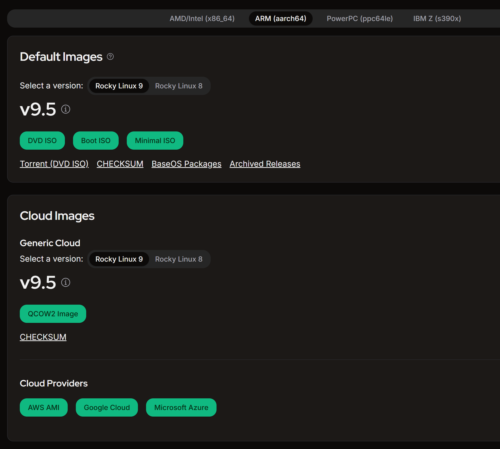
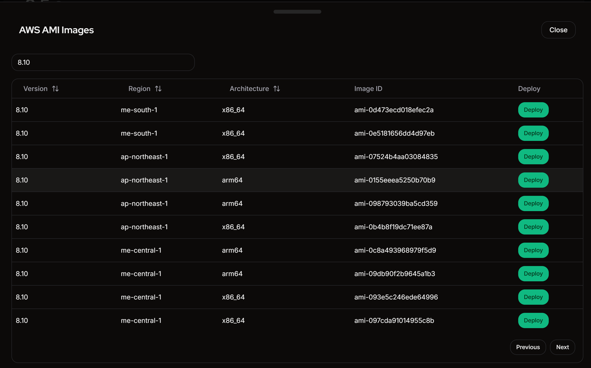
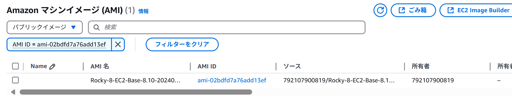
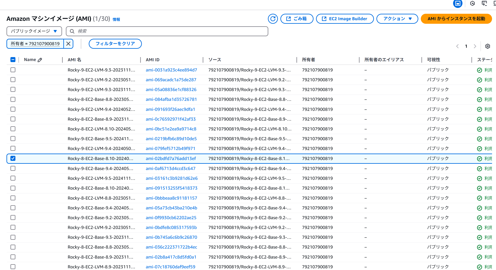
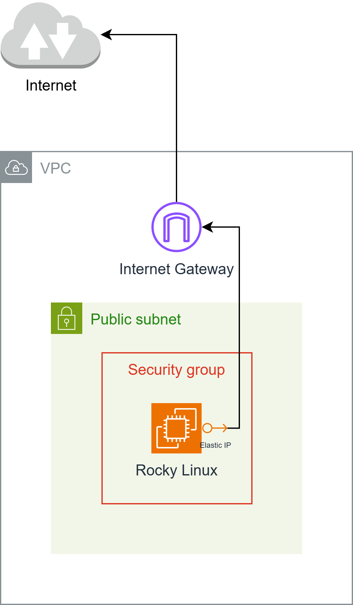
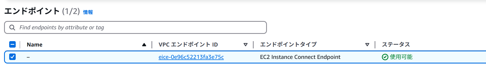
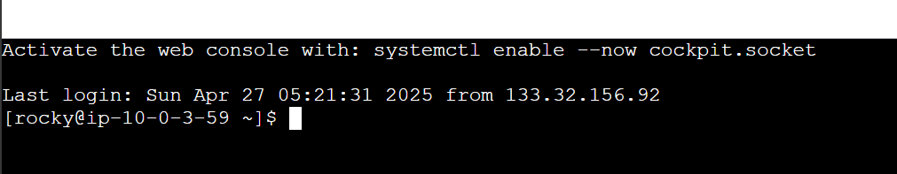

## AMI の選び方
公式ページから AMI を入手します。

https://rockylinux.org/ja-JP/download

インスタンスに設定するアーキテクチャー (ARM (aarch64)) を選び、
Cloud Images の AWS AMI を選択。



バージョン番号でフィルターを掛け、条件にあったものを探す。



AMI ID はコピーできないので、デプロイボタンをクリックし、AWS コンソールからコピーする。

AMI ID で検索を掛けると、でてくる



所有者でフィルタリングしたほうが良いかも。

所有者 = 792107900819



## 事前準備
- キーペアの登録
    - あらかじめ `ssh-keygen -t ed25519` コマンドを実行て公開鍵を作成し、`.ssh/id_ed25519.pub` をキーペアにインポートしておく
- AWS CLI の導入
    - CLI のインストール
    - アクセスキーの設定 (aws configure)

## ネットワークを建てる

NAT ゲートウェイよりも、パブリック IP アドレスのほうが安いので、Elastic IP を作成。

図にするとこんな感じで建てる。



## EC2 Instance Connect エンドポイントを作成


EC2 Instance Connect エンドポイントを作成することで AWS CLI からログインできる。

## インスタンスを建てる
- ping を要求を受け入れるため ICMP (エコー要求) を許可 (セキュリティグループ)
- SSH 接続ができるようにこれを許可する (セキュリティグループ)
- ムンバイリージョンと、arm64 が安い
- vCPU あたり 1.5 GiB の RAM が必要 (最低でも t4g.medium)

というわけで、以下の条件で建てた。

- ムンバイリージョン
- アーキテクチャ: arm64
- AMI: RHEL 8.10 (LVM, aarch64); ami-0415efd8380284dc4
- インスタンスタイプ: t4g.medium
- キーペア: PC で作った公開鍵 (.ssh/id_ed25519.pub)
- ネットワーク: パブリックサブネット (インターネットゲートウェイへのルートが定義されているルートテーブルが関連付けされている)
- セキュリティグループ: セキュリティグループを作成 (名前はデフォルト)
    - ssh, 0.0.0.0/0
    - カスタム ICMP - IPv4 (エコー要求), 0.0.0.0/0
- ストレージ: 1x 10GiB, gp3

## 接続
PC のターミナルを開き、以下を実行。

```bash
aws ec2-instance-connect ssh --private-key-file .ssh/id_ed25519 --os-user rocky --instance-id i-*****************
```

## Instance Connect パッケージのインストール
Rocky Linux の AMI イメージには、Instance Connect パッケージがなく、マネジメントコンソールからの接続ができない。
そのため、パッケージをインストールする。

https://docs.aws.amazon.com/ja_jp/AWSEC2/latest/UserGuide/ec2-instance-connect-set-up.html を参考にパッケージをダウンロード。

- ※RHEL のパッケージを選択
- ※OS のメジャーバージョンやアーキテクチャーが違うと正常に動作しないので注意

### 例

```bash
curl https://amazon-ec2-instance-connect-us-west-2.s3.us-west-2.amazonaws.com/latest/linux_arm64/ec2-instance-connect.rhel8.rpm -o /tmp/ec2-instance-connect.rpm
curl https://amazon-ec2-instance-connect-us-west-2.s3.us-west-2.amazonaws.com/latest/linux_amd64/ec2-instance-connect-selinux.noarch.rpm -o /tmp/ec2-instance-connect-selinux.rpm
sudo dnf install -y /tmp/ec2-instance-connect.rpm /tmp/ec2-instance-connect-selinux.rpm
```

インストールが完了すると、マネコン上からアクセスできるようになる



### CDK (typescript)
CDK 作ったので載せておく。参考までに。

keyName (キーペア) の名前は変えておく。

```typescript
import * as cdk from 'aws-cdk-lib';
import * as ec2 from 'aws-cdk-lib/aws-ec2';

export interface RockyLinuxStackProps extends cdk.StackProps {
}

export class RockyLinuxStack extends cdk.Stack {
  public constructor(scope: cdk.App, id: string, props: RockyLinuxStackProps = {}) {
    super(scope, id, props);

    // Resources
    const ec2dhcpOptions = new ec2.CfnDHCPOptions(this, 'EC2DHCPOptions', {
      domainName: 'ap-south-1.compute.internal',
      domainNameServers: [
        'AmazonProvidedDNS',
      ],
      tags: [
      ],
    });
    ec2dhcpOptions.cfnOptions.deletionPolicy = cdk.CfnDeletionPolicy.DELETE;

    const ec2InternetGateway = new ec2.CfnInternetGateway(this, 'EC2InternetGateway', {
      tags: [
        {
          value: 'igw',
          key: 'Name',
        },
      ],
    });
    ec2InternetGateway.cfnOptions.deletionPolicy = cdk.CfnDeletionPolicy.DELETE;

    const ec2vpc = new ec2.CfnVPC(this, 'EC2VPC', {
      cidrBlock: '10.0.0.0/16',
      enableDnsSupport: true,
      instanceTenancy: 'default',
      enableDnsHostnames: true,
      tags: [
        {
          value: 'vpc',
          key: 'Name',
        },
      ],
    });
    ec2vpc.cfnOptions.deletionPolicy = cdk.CfnDeletionPolicy.DELETE;

    const ec2VPCGatewayAttachment = new ec2.CfnVPCGatewayAttachment(this, 'EC2VPCGatewayAttachment', {
      vpcId: ec2vpc.ref,
      internetGatewayId: ec2InternetGateway.ref,
    });
    ec2VPCGatewayAttachment.cfnOptions.deletionPolicy = cdk.CfnDeletionPolicy.DELETE;

    const ec2NetworkAcl = new ec2.CfnNetworkAcl(this, 'EC2NetworkAcl', {
      vpcId: ec2vpc.ref,
      tags: [
      ],
    });
    ec2NetworkAcl.cfnOptions.deletionPolicy = cdk.CfnDeletionPolicy.DELETE;

    const ec2RouteTable = new ec2.CfnRouteTable(this, 'EC2RouteTable', {
      vpcId: ec2vpc.ref,
    });
    ec2RouteTable.cfnOptions.deletionPolicy = cdk.CfnDeletionPolicy.DELETE;

    const ec2SecurityGroup = new ec2.CfnSecurityGroup(this, 'EC2SecurityGroup', {
      groupDescription: 'launch-wizard-1 created 2025-04-27T00:11:58.641Z',
      groupName: 'launch-wizard-1',
      vpcId: ec2vpc.ref,
      securityGroupIngress: [
        {
          cidrIp: '0.0.0.0/0',
          ipProtocol: 'tcp',
          fromPort: 22,
          toPort: 22,
        },
        {
          cidrIp: '0.0.0.0/0',
          ipProtocol: 'icmp',
          fromPort: 8,
          toPort: -1,
        },
      ],
      securityGroupEgress: [
        {
          cidrIp: '0.0.0.0/0',
          ipProtocol: '-1',
          fromPort: -1,
          toPort: -1,
        },
      ],
    });
    ec2SecurityGroup.cfnOptions.deletionPolicy = cdk.CfnDeletionPolicy.DELETE;

    const ec2Subnet = new ec2.CfnSubnet(this, 'EC2Subnet', {
      vpcId: ec2vpc.ref,
      mapPublicIpOnLaunch: false,
      enableDns64: false,
      availabilityZoneId: 'aps1-az1',
      privateDnsNameOptionsOnLaunch: {
        EnableResourceNameDnsARecord: false,
        HostnameType: 'ip-name',
        EnableResourceNameDnsAAAARecord: false,
      },
      cidrBlock: '10.0.0.0/20',
      ipv6Native: false,
      tags: [
        {
          value: 'subnet-public1-ap-south-1a',
          key: 'Name',
        },
      ],
    });
    ec2Subnet.cfnOptions.deletionPolicy = cdk.CfnDeletionPolicy.DELETE;

    const ec2InstanceConnectEndpoint = new ec2.CfnInstanceConnectEndpoint(this, 'EC2InstanceConnectEndpoint', {
      preserveClientIp: false,
      securityGroupIds: [
        ec2SecurityGroup.attrGroupId,
      ],
      subnetId: ec2Subnet.attrSubnetId,
    });
    ec2InstanceConnectEndpoint.cfnOptions.deletionPolicy = cdk.CfnDeletionPolicy.DELETE;

    const ec2vpcdhcpOptionsAssociation = new ec2.CfnVPCDHCPOptionsAssociation(this, 'EC2VPCDHCPOptionsAssociation', {
      vpcId: ec2vpc.ref,
      dhcpOptionsId: ec2dhcpOptions.ref,
    });
    ec2vpcdhcpOptionsAssociation.cfnOptions.deletionPolicy = cdk.CfnDeletionPolicy.DELETE;

    const ec2RouteHg = new ec2.CfnRoute(this, 'EC2RouteHG', {
      routeTableId: ec2RouteTable.ref,
      destinationCidrBlock: '0.0.0.0/0',
      gatewayId: ec2InternetGateway.ref,
    });
    ec2RouteHg.cfnOptions.deletionPolicy = cdk.CfnDeletionPolicy.DELETE;

    const ec2SubnetNetworkAclAssociation = new ec2.CfnSubnetNetworkAclAssociation(this, 'EC2SubnetNetworkAclAssociation', {
      networkAclId: ec2NetworkAcl.ref,
      subnetId: ec2Subnet.ref,
    });
    ec2SubnetNetworkAclAssociation.cfnOptions.deletionPolicy = cdk.CfnDeletionPolicy.DELETE;

    const ec2SubnetRouteTableAssociation = new ec2.CfnSubnetRouteTableAssociation(this, 'EC2SubnetRouteTableAssociation', {
      routeTableId: ec2RouteTable.ref,
      subnetId: ec2Subnet.ref,
    });
    ec2SubnetRouteTableAssociation.cfnOptions.deletionPolicy = cdk.CfnDeletionPolicy.DELETE;

    const ec2Instance = new ec2.CfnInstance(this, 'EC2Instance', {
      tenancy: 'default',
      instanceInitiatedShutdownBehavior: 'stop',
      cpuOptions: {
        threadsPerCore: 1,
        coreCount: 2,
      },
      blockDeviceMappings: [
        {
          ebs: {
            volumeType: 'gp3',
            iops: 3000,
            volumeSize: 10,
            encrypted: false,
            deleteOnTermination: true,
          },
          deviceName: '/dev/sda1',
        },
      ],
      availabilityZone: 'ap-south-1a',
      privateDnsNameOptions: {
        enableResourceNameDnsARecord: false,
        hostnameType: 'ip-name',
        enableResourceNameDnsAaaaRecord: false,
      },
      ebsOptimized: true,
      disableApiTermination: false,
      keyName: 'hikari',
      sourceDestCheck: true,
      placementGroupName: '',
      networkInterfaces: [
        {
          privateIpAddresses: [
            {
              privateIpAddress: '10.0.3.59',
              primary: true,
            },
          ],
          secondaryPrivateIpAddressCount: 0,
          deviceIndex: '0',
          groupSet: [
            ec2SecurityGroup.ref,
          ],
          ipv6Addresses: [
          ],
          subnetId: ec2Subnet.ref,
          associatePublicIpAddress: true,
          deleteOnTermination: true,
        },
      ],
      imageId: 'ami-0415efd8380284dc4',
      instanceType: 't4g.medium',
      monitoring: false,
      tags: [
      ],
      creditSpecification: {
        cpuCredits: 'unlimited',
      },
    });
    ec2Instance.cfnOptions.deletionPolicy = cdk.CfnDeletionPolicy.DELETE;

    const ec2ElasticIp = new ec2.CfnEIP(this, 'EC2ElasticIp', {
      domain: 'vpc',
      tags: [
        {
          key: 'Name',
          value: 'elastic-ip',
        },
      ],
    });
    ec2ElasticIp.cfnOptions.deletionPolicy = cdk.CfnDeletionPolicy.DELETE;

    const ec2EipAssociation = new ec2.CfnEIPAssociation(this, 'EC2EipAssociation', {
      eip: ec2ElasticIp.ref,
      instanceId: ec2Instance.ref,
    });
    ec2EipAssociation.cfnOptions.deletionPolicy = cdk.CfnDeletionPolicy.DELETE;
  }
}
```