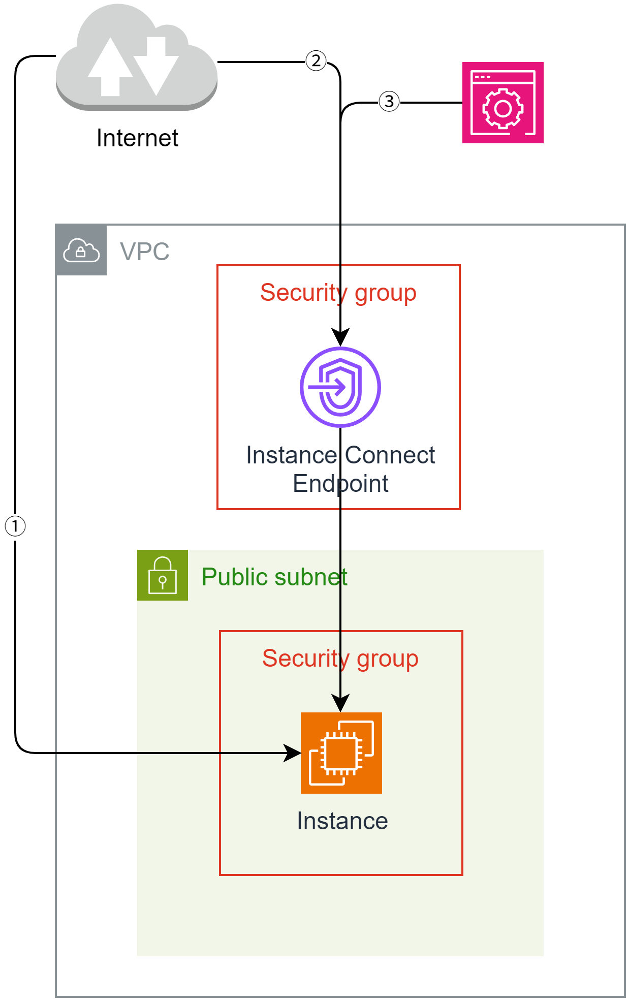

## EC2 Instance Connect とは
EC2 Instance Connect は、AWS EC2 インスタンスへの SSH 接続を簡素化するためのサービス。

従来の SSH 接続方法では、インスタンスに公開鍵を事前に配置する必要があったが、
EC2 Instance Connect を使用すると、一時的な SSH 公開鍵をインスタンスに送信し、接続を確立する。(ただし、一部の AMI を除き Instance Connect のパッケージをインストールする必要がある)

## インスタンスへの接続方法
インスタンスへの接続方法は何パターンか存在する。



### ① インターネットから直接 (インスタンス接続は関係ない)
インターネットから直接接続する方法は、インターネットゲートウェイを経由するか NAT ゲートウェイを経由する必要がある。また、パブリック IP アドレスが必要で閉域網に限定する場合は使えない。

ssh コマンドが使用可能なため、一番簡単である。

```bash
ssh <ユーザー名>@<パブリック IP アドレス>
```

### ② EC2 Instance Connect エンドポイントを経由した接続

AWS CLI を使用して、EC2 Instance Connect エンドポイントを使用して接続すれば、
パブリック IP アドレスは不要である。

また、その分の料金 (月数百円) を節約することができる。

AWS CLI を用いて、以下のようなコマンドで接続できるが、あらかじめキーペアをインポートして置き、インスタンスにキーペアを設定する必要がある。

具体的な接続方法は、例えば以下のコマンドから可能である。

```bash
aws ec2-instance-connect ssh --private-key-file .ssh/id_ed25519 --os-user <ユーザー名> --instance-id <インスタンス ID> --connection-type eice
```

※ただし、あらかじめアクセスキーを取得しておき、`aws configure` で設定しておく。

インターネットに接続したくないかつ公式ではない AMI を使用したいという場合にこの接続方法を使用するのが最も良い。

### ③ AWS マネジメントコンソールから Instance Connect 接続

Amazon Linux や Ubuntu は Instance Connect エンドポイントを作成しておけば、
マネジメントコンソール上からインスタンスに接続が可能である。

ただし、一部の AMI を除いて、Instance Connect のパッケージをインストールする必要がある。

詳しくは、https://docs.aws.amazon.com/ja_jp/AWSEC2/latest/UserGuide/ec2-instance-connect-set-up.html

### ④ その他の接続方法

#### セッションマネージャーからの接続
セッションマネージャー用にエンドポイントを 2 つ設置、加えてインスタンスにセッションマネージャーからの接続を許可する IAM ロールをアタッチする必要がある。

また、一部の AMI を除いて、Session Manager のパッケージのインストールが必要である。

#### EC2 シリアルコンソールからの接続
シリアルコンソールを用いると直接インスタンスへ接続が可能である。
パスワードが設定されていない場合はログインすらできないので注意である。

## セキュリティ設定

### ネットワーク ACL (インスタンスのあるサブネット)
デフォルトですべての通信が許可されているので、
デフォルトで使用する場合は特に設定は必要ない。

最低限必要な設定を以下に示す。

#### インバウンドルール
インバウンドルールは、SSH (22) を許可する必要がある。

インスタンスの SSH サーバーのポート番号が 22 であるため、これを許可する。

#### アウトバウンドルール
アウトバウンドルールは、カスタム TCP (1024-65535) を許可する必要がある。

1024-65535 は SSH 接続時にクライアント側が使用するポート範囲である。

### セキュリティグループ (インスタンス)
#### インバウンドルール
インバウンドルールは、SSH (22) を許可する必要がある。

**この設定は必ず必要である。**

### アウトバウンドルール
セキュリティグループは通信を記憶 (ステートフル) しているため、通常はアウトバウンドルールの設定は不要である。

### セキュリティグループ (EC2 Instance Connect エンドポイント)
#### インバウンドルール
ステートフルのため不要である。

#### アウトバウンドルール
SSH (22) を許可する必要がある。

インスタンスの 22 番ポートに対し通信するため、これを許可する。

