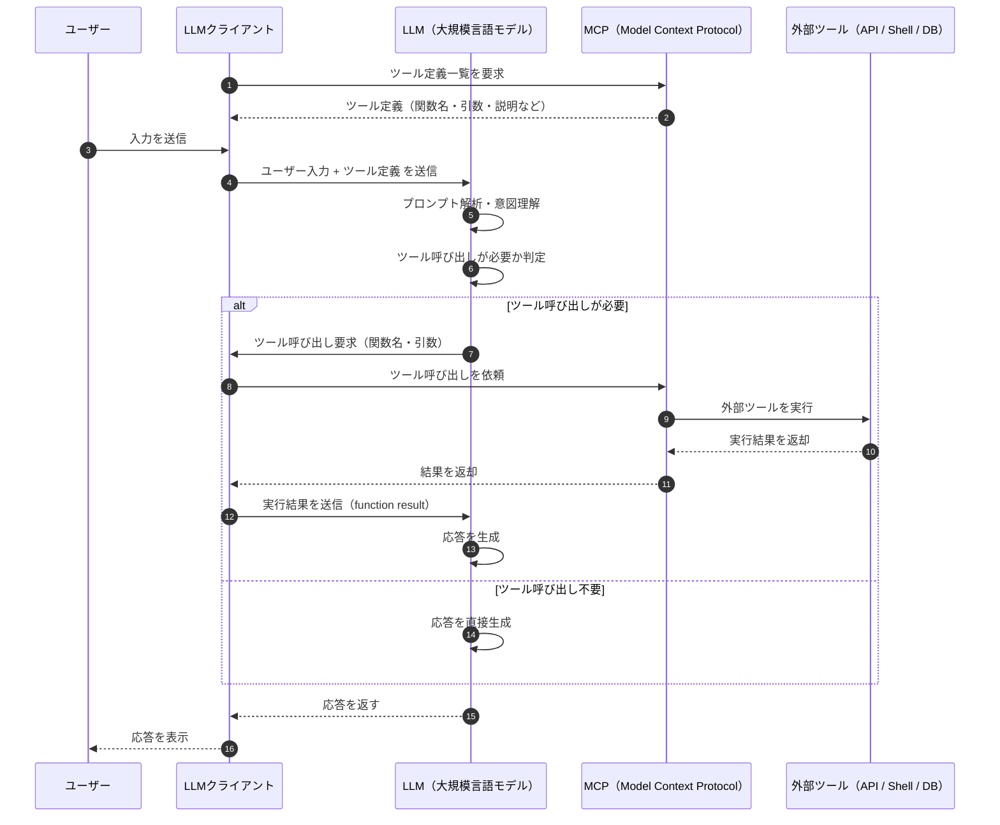

## 処理の流れ
MCP を使用した場合、LLM クライアントでどのような流れで処理が行われるかを Copilot くんに聞きました。

以下、シーケンス図です。



ここで重要なのは、

1. ①② ツール定義の取得
2. ④ ツール定義の送信
3. ⑦ ツール呼び出し要求
4. ⑧⑨⑩⑪ ツール呼び出し
5. ⑫ 実行結果の送信

です。

MCP にかかわる部分は、1. と 4. で、
Function calling とほぼ同じ部分が 2. と 3. と 5. です。

## コマンドを叩いて呼び出してみる

ローカル MCP を標準入力で使用してみましょう。

Windows PowerShell を用いてコマンドをたたきます。

### ツール一覧を取得
例として `@modelcontextprotocol/server-filesystem` のツール一覧を取得します。

```ps1
> @{ jsonrpc = "2.0"; method = "tools/list"; id = 1 } | ConvertTo-Json -Compress | npx @modelcontextprotocol/server-filesystem $HOME | ConvertFrom-Json | ConvertTo-Json -Depth 10
Secure MCP Filesystem Server running on stdio
Allowed directories: [ 'C:\\Users\\hikari' ]
{
  "result": {
    "tools": [
      {
        "name": "read_file",
        "description": "Read the complete contents of a file from the file system. Handles various text encodings and provides detailed error messages if the file cannot be read. Use this tool when you need to examine the contents of a single file. Only works within allowed directories.",
        "inputSchema": {
          "type": "object",
          "properties": {
            "path": {
              "type": "string"
            }
          },
          "required": [
            "path"
          ],
          "additionalProperties": false,
          "$schema": "http://json-schema.org/draft-07/schema#"
        }
      },
      ...
    ]
  }
}
```

`tools/list` を標準入力で与えることで、ツール一覧を JSON 形式で取得できます。

### ツール呼び出し
ツールの情報をもとに呼び出してみます。

```ps1
> @{ jsonrpc = "2.0"; method = "tools/call"; params = @{name = "read_file"; arguments = @{path = ".gitconfig"}}; id = 2 } | ConvertTo-Json -Compress -Depth 10 | npx @modelcontextprotocol/server-filesystem $HOME | ConvertFrom-Json | ConvertTo-Json -Depth 10
Secure MCP Filesystem Server running on stdio
Allowed directories: [ 'C:\\Users\\hikari' ]
{
  "result": {
    "content": [
      {
        "type": "text",
        "text": "..."
      }
    ]
  },
  "jsonrpc": "2.0",
  "id": 2
}
```
