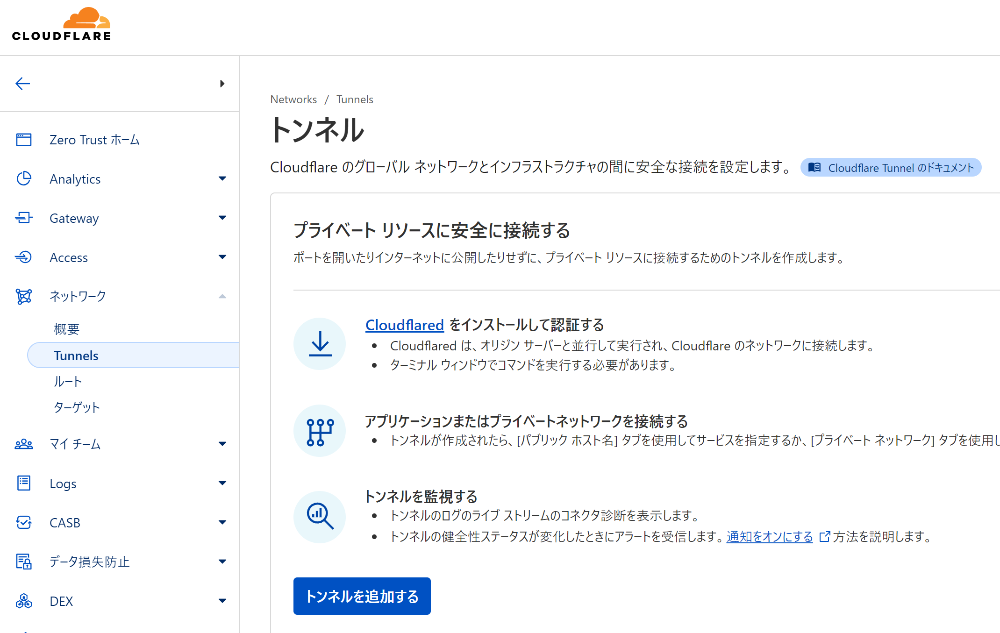
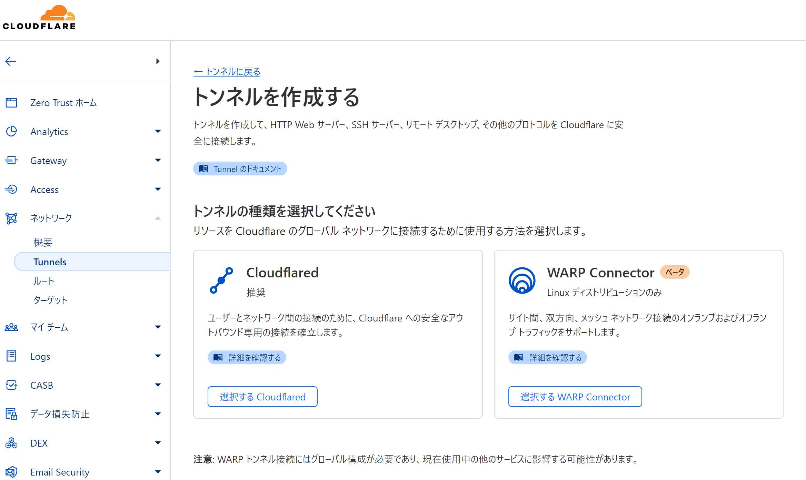
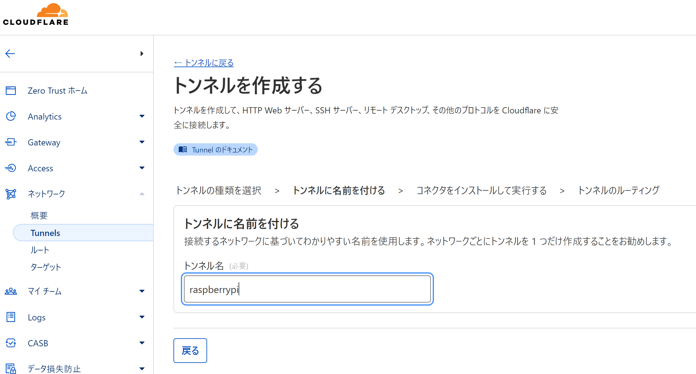

## Raspberry Pi で nginx をセットアップ

```sh
# nginx のインストールと有効化
sudo dnf install nginx

# /etc/nginx/nginx.conf の編集
# sudo nano /etc/nginx/nginx.conf

# nginx の開始と有効化
sudo systemctl start nginx
sudo systemctl enable nginx
sudo systemctl status nginx
```

## /etc/nginx/nginx.conf の編集
`http { server {} }` 内に以下を追加

```
location / {
    return 200 'Hello, world!';
    add_header Content-Type text/plain;
}
```

## CloudFlare の設定
1. https://one.dash.cloudflare.com/ にアクセス。
2. 「ネットワーク」→「Tunnels」を開く
3. 「トンネルを追加する」を押す



4. 「選択する Cloudflared」を押す



5. 「トンネル名」に適当な名前を入力して、「トンネルを保存」を押す



## cloudflared のインストール
```sh
# cloudflared.repo を /etc/yum.repos.d/ に追加
curl -fsSl https://pkg.cloudflare.com/cloudflared-ascii.repo | sudo tee /etc/yum.repos.d/cloudflared.repo

sudo dnf clean packages

# cloudflared のインストール
sudo dnf install -y cloudflared --nogpgcheck
```

## cloudflared でサービスの起動
```sh
sudo cloudflared service install xxxxxxxxxxxxxxxxxxxxxxxxxxxxxxxxxxxxxxxxxxxxxxxxxxxxxxxxxxxxxxxxxxxxxxxxxxxxxxxxxxxxxxxxxxxxxxxxxxxxxxxxxxxxxxxxxxxxxxxxxxxxxxxxxxxxxxxxxxxxxxxxxxxxxxxxxxxxxxxxxxxxxxxxxxxxxxxxxxxxxxxx
```

## トラフィックのルーティング
ホスト名のサブドメインとドメインと、サービスのタイプ、URL を設定。


「セットアップを完了する」を押す。

