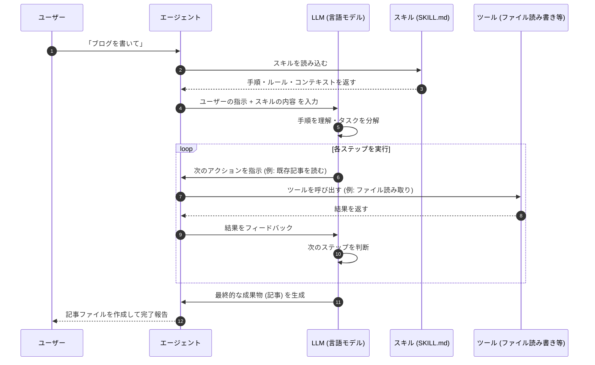

AI エージェントに「スキル」を追加すると、まるでアプリに機能拡張をインストールするように、できることを増やせます。この記事では、Agent Skills の仕組みと、エージェントが内部でどのような処理をしているかを解説します。

<!-- truncate -->

## AI エージェントとは

まず前提として、AI エージェントとは **指示を受け取り、自律的にタスクをこなすAIプログラム** のことです。

ChatGPT のような「質問して回答をもらうだけ」の AI と違い、エージェントは次のようなことができます。

- ファイルを読み書きする
- コードを実行して結果を確認する
- 外部 API やツールを呼び出す
- 複数のステップを自分で判断しながら進める

## スキルとは

[Agent Skills](https://agentskills.io/home) とは、**エージェントに新しい能力や専門知識を追加するための仕組み** です。

人間に例えると、「新しい仕事のマニュアルを渡す」ようなイメージです。マニュアル (スキル) を読んだエージェントは、そのタスクをどう進めればいいか理解して動けるようになります。

```
スキルなし: 「ブログを書いて」→ エージェントが何となく書く
スキルあり: 「ブログを書いて」→ マニュアル通りの手順で、一定品質のブログを書く
```

スキルは主に Markdown ファイル (`SKILL.md`) で記述されており、以下の要素を含められます。

- **手順書**: 何をどの順番でするか
- **スクリプト**: 自動化したい処理
- **サンプルや設定**: エージェントが参照するリソース

## なぜスキルが必要なのか

AIエージェントは非常に高い能力を持っていますが、**あなたのプロジェクト固有の知識は持っていません**。

たとえば、

- 「このチームではコミットメッセージをどう書くか」
- 「このブログのフロントマターはどう書くか」
- 「デプロイ手順はどのコマンドを使うか」

こういった情報は、スキルとして渡さないとエージェントは知ることができません。スキルがあることで、エージェントは「正しいやり方」を知った上で動けます。

## エージェントがスキルを使うときの処理の流れ

では、エージェントが内部でどのように動いているか見てみましょう。



ポイントは以下の通りです。

### 1. スキルの読み込み

エージェントは最初にスキルを読み込みます。スキルの内容は LLM への入力 (プロンプト) の一部として渡されます。LLM はこれを読んで「このタスクの正しいやり方」を理解します。

### 2. タスクの分解

LLM は受け取った手順をもとに、タスクを小さなステップに分解します。「まず既存記事を3件読む」「次にファイル名を決める」「フロントマターを書く」…という具合です。

### 3. ツールの呼び出し

各ステップで必要に応じてツールを呼び出します。ファイルを読む、ウェブを検索する、コードを実行するなど、スキルが定義した手順に従って進みます。

### 4. 結果のフィードバック

ツールの実行結果は再び LLM に渡されます。LLM はその結果を見て「次に何をすべきか」を判断し、タスクが完了するまでループします。

## スキルコマンド

スキルはスラッシュコマンド (`/コマンド名`) として呼び出せます。

コマンドが呼ばれると、対応する Markdown ファイルの内容がプロンプトとして展開され、エージェントがその手順を実行し始めます。

## スキルの広がり

Agent Skills のフォーマットは [Anthropic が開発しオープン化したもの](https://agentskills.io/home) で、現在は多くのツールに対応しています。

| ツール | 対応 |
|--------|------|
| Claude Code | ✅ |
| GitHub Copilot | ✅ |
| Cursor | ✅ |
| Gemini CLI | ✅ |
| OpenAI Codex | ✅ |
| VS Code | ✅ |

同じスキルを複数のツールで使い回せるのが大きな利点です。

## まとめ

- **スキル**は、エージェントに専門知識や手順を渡すための仕組みです
- Markdown ファイル (`SKILL.md`) に手順やルールを書くだけで作れます
- エージェントはスキルをプロンプトとして受け取り、LLM がそれを解釈してステップごとに実行します
- Claude Code、Cursor、GitHub Copilot など多くのツールで共通して使えるオープンな標準フォーマットです

スキルを活用することで、「AIに毎回同じことを説明する」手間がなくなり、エージェントが一貫した品質でタスクをこなせるようになります。
