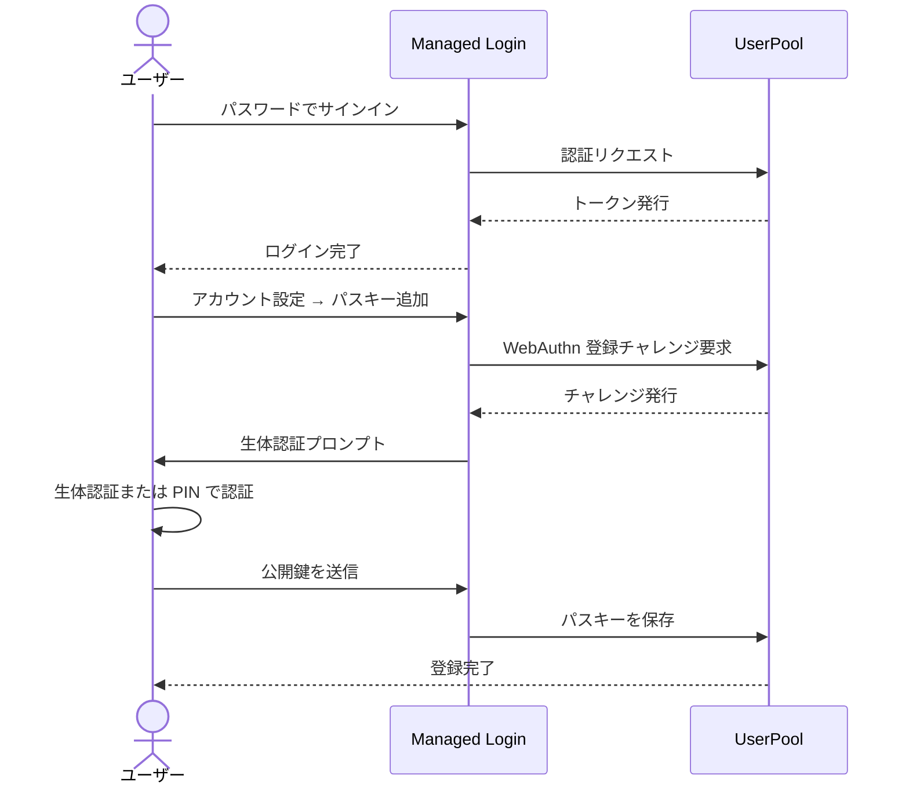
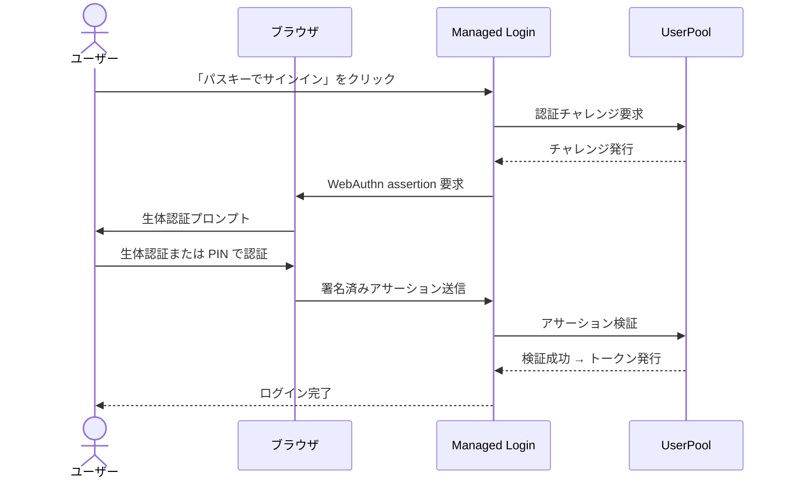

AWS SAM で構築したファイルストレージ API のユーザー認証に Amazon Cognito を使っている。先日、パスキー (WebAuthn) によるログインを追加したので、設定内容をまとめる。

{/* truncate */}

## 前提条件：パスキーに必要な Cognito の設定

Cognito でパスキーを使うには、以下がすべて揃っている必要がある。

| 要件 | 今回の構成 |
|------|-----------|
| UserPool Tier | **ESSENTIALS** 以上 |
| Managed Login | **v2** (新しいログイン UI) |
| カスタムドメイン | `login.example.com` (Relying Party ID に使用) |

Cognito のパスキーは Managed Login v2 UI から登録・使用する形になる。LITE tier (無料) では WebAuthn は使えないため、ESSENTIALS tier が必要である。

## 認証フロー

### パスキー登録フロー

初回はパスワードでログインし、アカウント設定からパスキーを登録する。



### パスキーログインフロー

登録後は「パスキーでサインイン」ボタンから直接認証できる。



## 設定内容

パスキー追加のために `template.yaml` (SAM テンプレート) に加えた変更はわずか 6 行である。

### 変更前

```yaml
UserPool:
  Type: AWS::Cognito::UserPool
  Properties:
    # ...
    Policies:
      PasswordPolicy:
        MinimumLength: 8
        # ...
    MfaConfiguration: "OFF"
```

### 変更後

```yaml
UserPool:
  Type: AWS::Cognito::UserPool
  Properties:
    # ...
    Policies:
      PasswordPolicy:
        MinimumLength: 8
        # ...
      SignInPolicy:
        AllowedFirstAuthFactors:
          - PASSWORD
          - WEB_AUTHN       # ← パスキーを追加
    MfaConfiguration: "OFF"
    WebAuthnRelyingPartyID: login.example.com   # ← RP ID を指定
    WebAuthnUserVerification: required              # ← 生体認証等を必須に
```

## 各パラメータの意味

### `SignInPolicy.AllowedFirstAuthFactors`

最初の認証ステップで使える認証方式のリストである。`PASSWORD` だけだとパスワードのみ、`WEB_AUTHN` を追加するとパスキーも選べるようになる。

### `WebAuthnRelyingPartyID`

WebAuthn の **Relying Party ID (RP ID)** である。パスキーはこのドメインに紐付いて生成・保存されるため、**実際にログインページを配信しているドメインと一致させる必要がある**。

今回はカスタムドメイン `login.example.com` をそのまま指定している。Cognito デフォルトドメイン (`xxx.auth.ap-northeast-1.amazoncognito.com`) を使っている場合はそちらを指定する。

### `WebAuthnUserVerification`

パスキー使用時のユーザー確認レベルである。

| 値 | 説明 |
|----|------|
| `required` | 生体認証・PIN など本人確認を必須とする |
| `preferred` | 可能なら本人確認、なくても許可する |
| `discouraged` | 本人確認を省略する (生体認証等なし) |

セキュリティ強化のため `required` を選択した。

## Managed Login の UI

Managed Login v2 の画面では、パスキー設定後にログイン画面へ「パスキーでサインイン」ボタンが自動で追加される。初回登録時はパスワードでログインした後、アカウント設定からパスキーを追加できる。

## デプロイ

```bash
sam build
sam deploy --no-confirm-changeset
```

`samconfig.toml` にスタック名・リージョン・パラメータを定義済みなので、毎回オプション指定は不要である。

## まとめ

Cognito でパスキーを有効にするポイントをまとめると:

1. **ESSENTIALS tier** に設定する (LITE では WebAuthn 非対応)
2. **Managed Login v2** を使う
3. **カスタムドメイン** (または Cognito デフォルトドメイン) を RP ID として指定する
4. `SignInPolicy.AllowedFirstAuthFactors` に `WEB_AUTHN` を追加する
5. `WebAuthnUserVerification: required` で生体認証を必須にする

たった 6 行の変更でパスキーログインが使えるようになった。パスワードは残しつつ段階的にパスキーへ移行できるのが Cognito の便利なところである。
