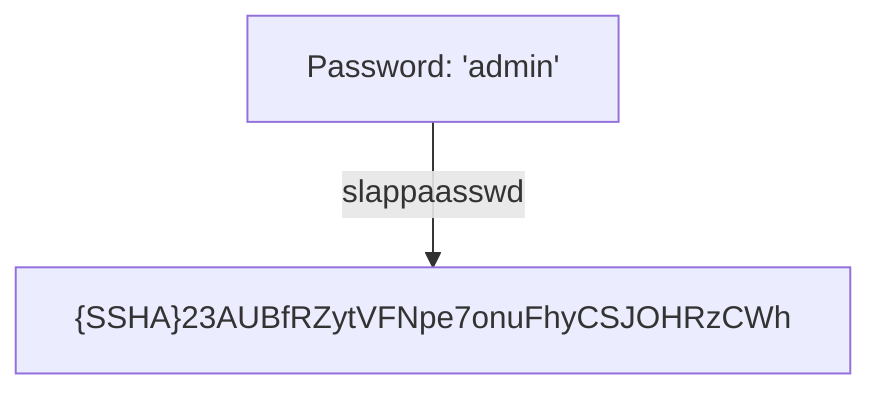
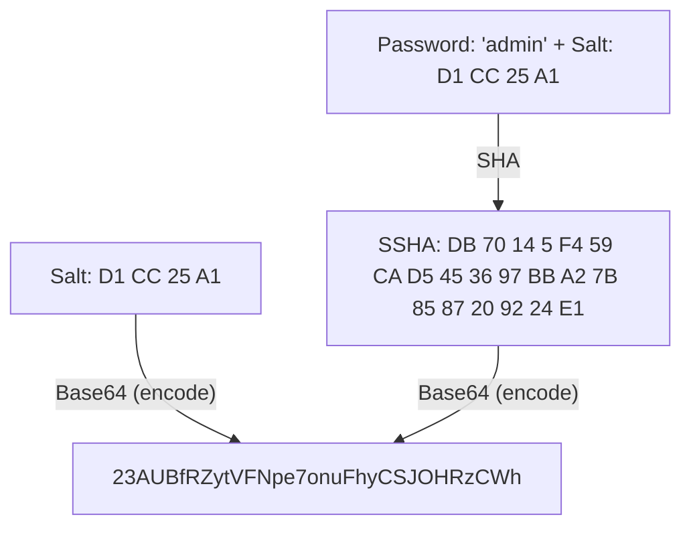

## What is the slappaasswd command?
The slappaasswd command is a command for generating passwords for OpenLDAP, which uses SSHA by default to hash the password.



## Authentication mechanism
In SSHA, the last 4 bytes of the generated hash are the salt. Authentication is performed by generating a hash from the input password and the stored salt, and checking if it matches the stored hash.



The following program, when given a valid password (e.g., admin), will produce the same original hash and generated hash.

```rb
require 'base64'
require 'digest'

pass = 'admin'
ssha = '{SSHA}23AUBfRZytVFNpe7onuFhyCSJOHRzCWh'
ssha =~ /{.+}(.+)/
salt256s = Base64.decode64(Regexp.last_match(1)).unpack('C*'[-4..-1])

salt = salt256s.pack('C*')
b_ssha = Digest::SHA1.digest(pass + salt)
Base64.strict_encode64(
 (b_ssha.unpack('C*') + salt256s).pack('C*')
)
```
[EOL]