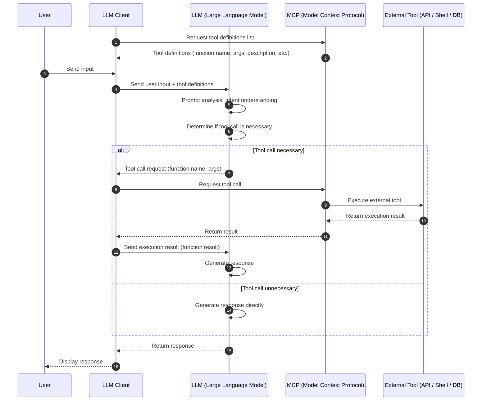

## Processing Flow
I asked GitHub Copilot about the processing flow in an LLM client when using MCP.

Below is a sequence diagram.



What's important here are:

1.  ①② Retrieving tool definitions
2.  ④ Sending tool definitions
3.  ⑦ Tool call request
4.  ⑧⑨⑩⑪ Calling the tool
5.  ⑫ Sending the execution result

The parts related to MCP are 1. and 4., while parts 2., 3., and 5. are almost identical to Function Calling.

## Calling Tools from the Command Line

Let's use local MCP with standard input.

We'll execute commands using Windows PowerShell.

### Retrieving the Tool List
As an example, let's retrieve the tool list for `@modelcontextprotocol/server-filesystem`.

```ps1
> @{ jsonrpc = "2.0"; method = "tools/list"; id = 1 } | ConvertTo-Json -Compress | npx @modelcontextprotocol/server-filesystem $HOME | ConvertFrom-Json | ConvertTo-Json -Depth 10
Secure MCP Filesystem Server running on stdio
Allowed directories: [ 'C:\\Users\\hikari' ]
{
  "result": {
  "tools": [
    {
    "name": "read_file",
    "description": "Read the complete contents of a file from the file system. Handles various text encodings and provides detailed error messages if the file cannot be read. Use this tool when you need to examine the contents of a single file. Only works within allowed directories.",
    "inputSchema": {
      "type": "object",
      "properties": {
      "path": {
        "type": "string"
      }
      },
      "required": [
      "path"
      ],
      "additionalProperties": false,
      "$schema": "http://json-schema.org/draft-07/schema#"
    }
    },
    ...
  ]
  }
}
```

By providing `tools/list` via standard input, you can retrieve the tool list in JSON format.

### Calling a Tool
Let's call a tool based on its information.

```ps1
> @{ jsonrpc = "2.0"; method = "tools/call"; params = @{name = "read_file"; arguments = @{path = ".gitconfig"}}; id = 2 } | ConvertTo-Json -Compress -Depth 10 | npx @modelcontextprotocol/server-filesystem $HOME | ConvertFrom-Json | ConvertTo-Json -Depth 10
Secure MCP Filesystem Server running on stdio
Allowed directories: [ 'C:\\Users\\hikari' ]
{
  "result": {
  "content": [
    {
    "type": "text",
    "text": "..."
    }
  ]
  },
  "jsonrpc": "2.0",
  "id": 2
}
```
