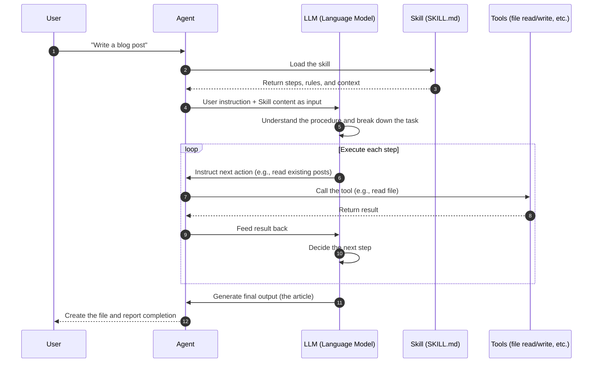

Adding "skills" to an AI agent lets you extend its capabilities, just like installing a plugin for an app. This article explains how Agent Skills work and what an agent actually does internally when using them.

{/**/}

## What Is an AI Agent?

First, an AI agent is an **AI program that receives instructions and autonomously completes tasks**.

Unlike a simple AI that just answers questions (like ChatGPT in basic use), an agent can:

- Read and write files
- Execute code and check results
- Call external APIs and tools
- Make decisions across multiple steps on its own

## What Are Skills?

[Agent Skills](https://agentskills.io/home) is a mechanism for **giving agents new abilities and domain knowledge**.

Think of it like handing a new employee a work manual. Once the agent reads the manual (the skill), it understands how to approach that task correctly.

```
Without skills: "Write a blog post" → Agent writes something generic
With skills:    "Write a blog post" → Agent follows the manual and produces consistent, quality output
```

Skills are primarily written as Markdown files (`SKILL.md`) and can include:

- **Step-by-step procedures**: What to do and in what order
- **Scripts**: Automatable processes
- **Samples and config**: Resources for the agent to reference

## Why Are Skills Needed?

AI agents are extremely capable, but they **don't know anything specific about your project**.

For example:

- "How does this team write commit messages?"
- "What frontmatter format does this blog use?"
- "Which commands are used for deployment?"

Without skills, agents can't know any of this. Skills let agents understand "the right way to do things" before acting.

## How an Agent Processes a Skill

Let's look at what's happening inside the agent.



Here are the key points:

### 1. Loading the Skill

The agent reads the skill at the start. The skill content is passed as part of the LLM's input (prompt). The LLM reads this and understands "the right approach for this task."

### 2. Breaking Down the Task

Based on the instructions, the LLM breaks the task into smaller steps: "Read 3 existing posts first," "then decide on a filename," "then write the frontmatter," and so on.

### 3. Calling Tools

At each step, the agent calls tools as needed — reading files, searching the web, executing code — following the procedure defined by the skill.

### 4. Feeding Back Results

Tool results are passed back to the LLM. The LLM looks at the results and decides what to do next, looping until the task is complete.

## Skill Commands

Skills can be invoked as slash commands (`/command-name`).

When a command is called, the corresponding Markdown file's content is expanded as a prompt, and the agent begins executing those steps.

## Skills Are Growing

The Agent Skills format was [developed and open-sourced by Anthropic](https://agentskills.io/home) and is now supported by many tools:

| Tool | Supported |
|------|-----------|
| Claude Code | ✅ |
| GitHub Copilot | ✅ |
| Cursor | ✅ |
| Gemini CLI | ✅ |
| OpenAI Codex | ✅ |
| VS Code | ✅ |

The biggest advantage is that the same skill can be reused across different tools.

## Summary

- **Skills** are a mechanism for giving agents specialized knowledge and procedures
- You can create one by writing steps and rules in a Markdown file (`SKILL.md`)
- The agent receives the skill as a prompt; the LLM interprets it and executes each step
- It's an open standard supported by Claude Code, Cursor, GitHub Copilot, and many more

With skills, you no longer have to explain the same things to your AI every time — agents can perform tasks with consistent quality, exactly the way you want.
