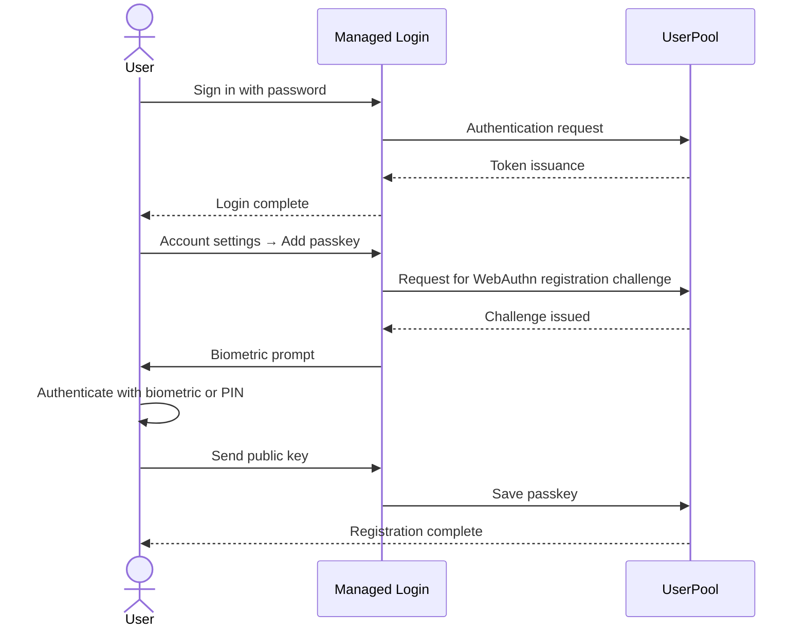
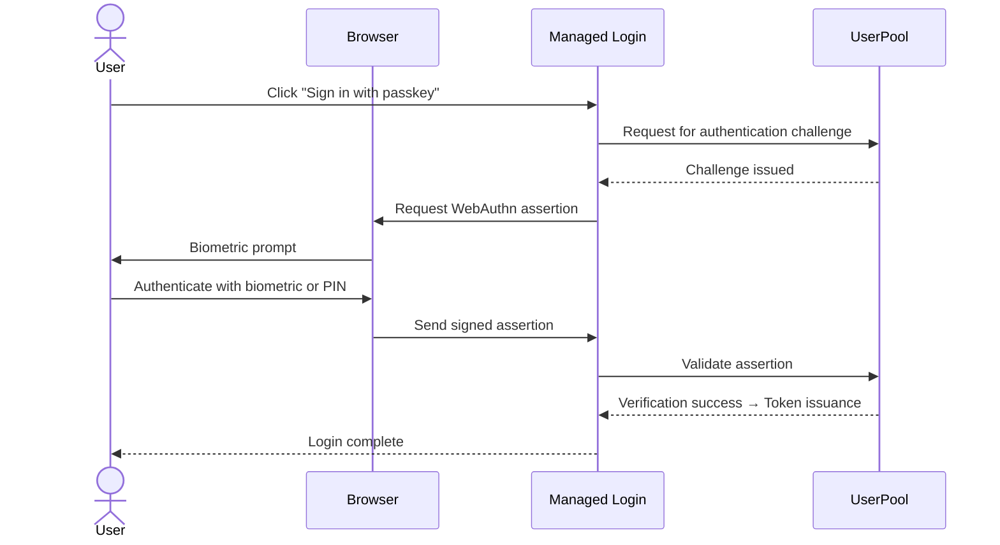

I am using Amazon Cognito for user authentication in a file storage API built with AWS SAM. Recently, I added login via passkeys (WebAuthn), so I will summarize the configuration details.

## Prerequisites: Required Cognito Settings for Passkeys

To use passkeys with Cognito, the following must all be in place:

| Requirement | Current Configuration |
|-------------|-----------------------|
| UserPool Tier | **ESSENTIALS** or higher |
| Managed Login | **v2** (New login UI) |
| Custom Domain | `login.example.com` (Used as Relying Party ID) |

Cognito's passkeys will be registered and used through the Managed Login v2 UI. WebAuthn cannot be used with the LITE tier (free), so the ESSENTIALS tier is necessary.

## Authentication Flow

### Passkey Registration Flow

For the first time, log in with a password and register the passkey from the account settings.



### Passkey Login Flow

After registration, authentication can be done directly via the "Sign in with passkey" button.



## Configuration Details

The changes made to the `template.yaml` (SAM template) for adding the passkey amount to just 6 lines.

### Before Changes

```yaml
UserPool:
  Type: AWS::Cognito::UserPool
  Properties:
    # ...
    Policies:
      PasswordPolicy:
        MinimumLength: 8
        # ...
    MfaConfiguration: "OFF"
```

### After Changes

```yaml
UserPool:
  Type: AWS::Cognito::UserPool
  Properties:
    # ...
    Policies:
      PasswordPolicy:
        MinimumLength: 8
        # ...
      SignInPolicy:
        AllowedFirstAuthFactors:
          - PASSWORD
          - WEB_AUTHN       # ← Added passkey
    MfaConfiguration: "OFF"
    WebAuthnRelyingPartyID: login.example.com   # ← Specify RP ID
    WebAuthnUserVerification: required              # ← Require biometric verification
```

## Explanation of Each Parameter

### `SignInPolicy.AllowedFirstAuthFactors`

This is the list of authentication methods that can be used during the first authentication step. With only `PASSWORD`, it allows password-only authentication; adding `WEB_AUTHN` allows passkeys as an option.

### `WebAuthnRelyingPartyID`

This is the **Relying Party ID (RP ID)** for WebAuthn. Passkeys are generated and stored associated with this domain, so it **must match the domain serving the actual login page**.

In this case, I have directly specified the custom domain `login.example.com`. If you are using the Cognito default domain (`xxx.auth.ap-northeast-1.amazoncognito.com`), specify that one.

### `WebAuthnUserVerification`

This defines the required level of user verification when using passkeys.

| Value | Description |
|-------|-------------|
| `required` | Requires biometric authentication or PIN |
| `preferred` | Prefer user verification but allow even without it |
| `discouraged` | Skip user verification (no biometric, etc.) |

To enhance security, I chose `required`.

## Managed Login UI

In the Managed Login v2 interface, after configuring the passkey, the "Sign in with passkey" button will be automatically added to the login screen. For initial registration, you can add a passkey from the account settings after logging in with a password.

## Deployment

```bash
sam build
sam deploy --no-confirm-changeset
```

Since the stack name, region, and parameters are defined in `samconfig.toml`, there is no need to specify options each time.

## Conclusion

The key points for enabling passkeys in Cognito are:

1. Set to **ESSENTIALS tier** (LITE does not support WebAuthn)
2. Use **Managed Login v2**
3. Specify a **custom domain** (or the Cognito default domain) as the RP ID
4. Add `WEB_AUTHN` to `SignInPolicy.AllowedFirstAuthFactors`
5. Set `WebAuthnUserVerification: required` to make biometric verification mandatory

With just 6 lines of changes, passkey login has become available. The convenience of Cognito lies in the ability to gradually transition to passkeys while still retaining passwords.