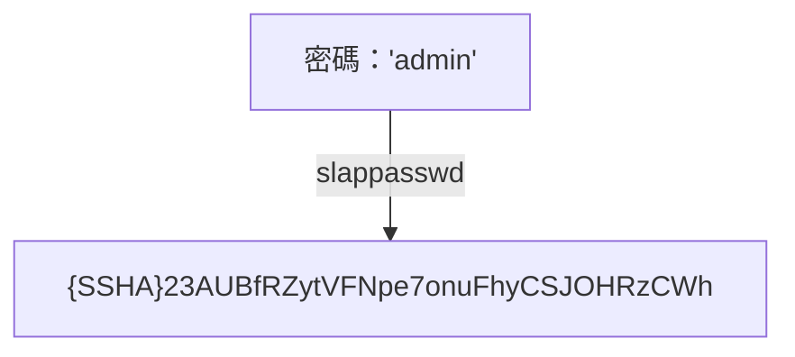
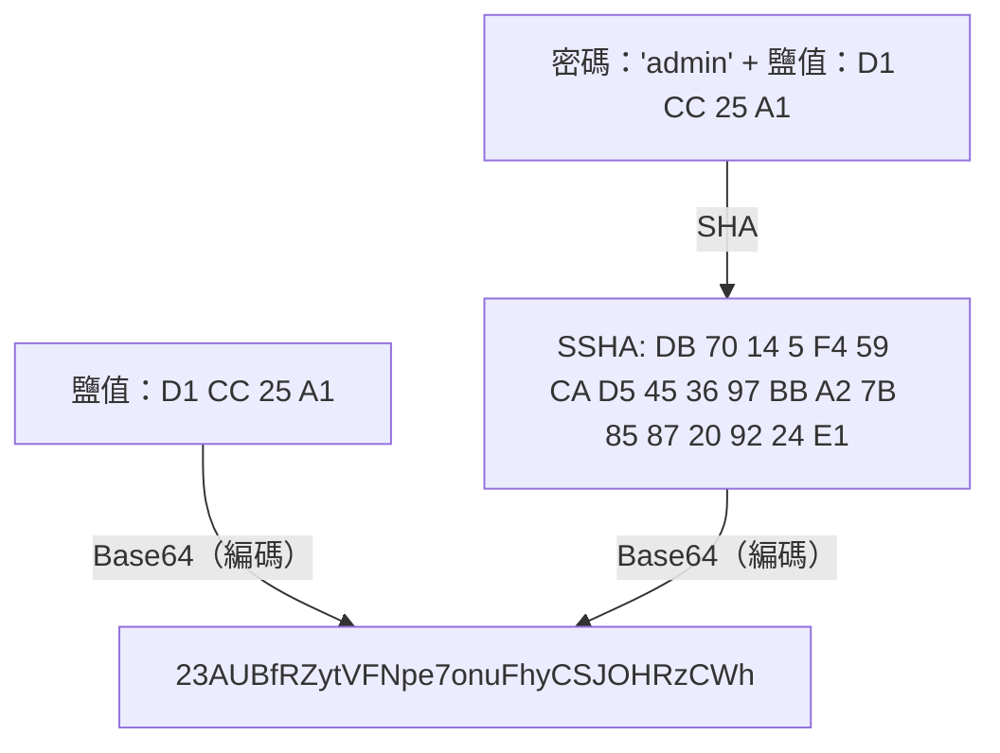

## slappasswd 指令是什麼？
slappasswd 指令是用來為 OpenLDAP 產生密碼的工具，預設使用 SSHA 對密碼進行雜湊處理。



## 認證機制
在 SSHA 中，產生的雜湊值最後 4 個位元組為鹽值（salt）。認證時，系統會將輸入的密碼與儲存的鹽值組合後產生雜湊，並比對是否與儲存的雜湊相符。



以下程式在輸入正確密碼（例如 admin）時，會產生與原始雜湊相同的結果。

```rb
require 'base64'
require 'digest'

pass = 'admin'
ssha = '{SSHA}23AUBfRZytVFNpe7onuFhyCSJOHRzCWh'
ssha =~ /{.+}(.+)/
salt256s = Base64.decode64(Regexp.last_match(1)).unpack('C*'[-4..-1])

salt = salt256s.pack('C*')
b_ssha = Digest::SHA1.digest(pass + salt)
Base64.strict_encode64(
 (b_ssha.unpack('C*') + salt256s).pack('C*')
)
```
[EOL]
