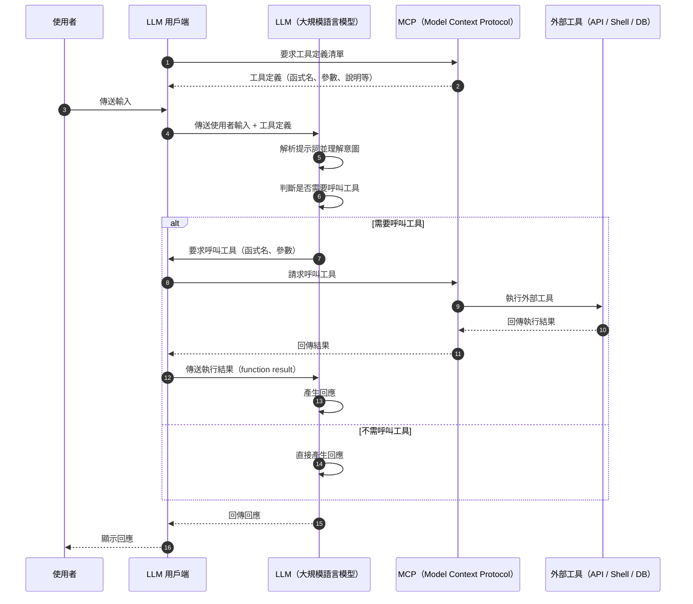

## 處理流程
使用 MCP 時，我問了 Copilot 小幫手，LLM 用戶端會以什麼樣的流程進行處理。

以下為序列圖。



這裡重要的是：

1. ①② 取得工具定義
2. ④ 傳送工具定義
3. ⑦ 工具呼叫要求
4. ⑧⑨⑩⑪ 工具呼叫
5. ⑫ 傳送執行結果

與 MCP 有關的部分是 1. 和 4.，而與 Function calling（函式呼叫）幾乎相同的部分是 2.、3. 和 5.。

## 在終端機輸入指令來呼叫看看

來嘗試以標準輸入使用本地 MCP。

我用 Windows PowerShell 執行指令。

### 取得工具清單
舉例取得 `@modelcontextprotocol/server-filesystem` 的工具清單。

```ps1
> @{ jsonrpc = "2.0"; method = "tools/list"; id = 1 } | ConvertTo-Json -Compress | npx @modelcontextprotocol/server-filesystem $HOME | ConvertFrom-Json | ConvertTo-Json -Depth 10
Secure MCP Filesystem Server running on stdio
Allowed directories: [ 'C:\\Users\\hikari' ]
{
  "result": {
    "tools": [
      {
        "name": "read_file",
        "description": "Read the complete contents of a file from the file system. Handles various text encodings and provides detailed error messages if the file cannot be read. Use this tool when you need to examine the contents of a single file. Only works within allowed directories.",
        "inputSchema": {
          "type": "object",
          "properties": {
            "path": {
              "type": "string"
            }
          },
          "required": [
            "path"
          ],
          "additionalProperties": false,
          "$schema": "http://json-schema.org/draft-07/schema#"
        }
      },
      ...
    ]
  }
}
```

把 `tools/list` 透過標準輸入傳入，就能以 JSON 格式取得工具清單。

### 呼叫工具
根據工具資訊來呼叫它。

```ps1
> @{ jsonrpc = "2.0"; method = "tools/call"; params = @{name = "read_file"; arguments = @{path = ".gitconfig"}}; id = 2 } | ConvertTo-Json -Compress -Depth 10 | npx @modelcontextprotocol/server-filesystem $HOME | ConvertFrom-Json | ConvertTo-Json -Depth 10
Secure MCP Filesystem Server running on stdio
Allowed directories: [ 'C:\\Users\\hikari' ]
{
  "result": {
    "content": [
      {
        "type": "text",
        "text": "..."
      }
    ]
  },
  "jsonrpc": "2.0",
  "id": 2
}
```