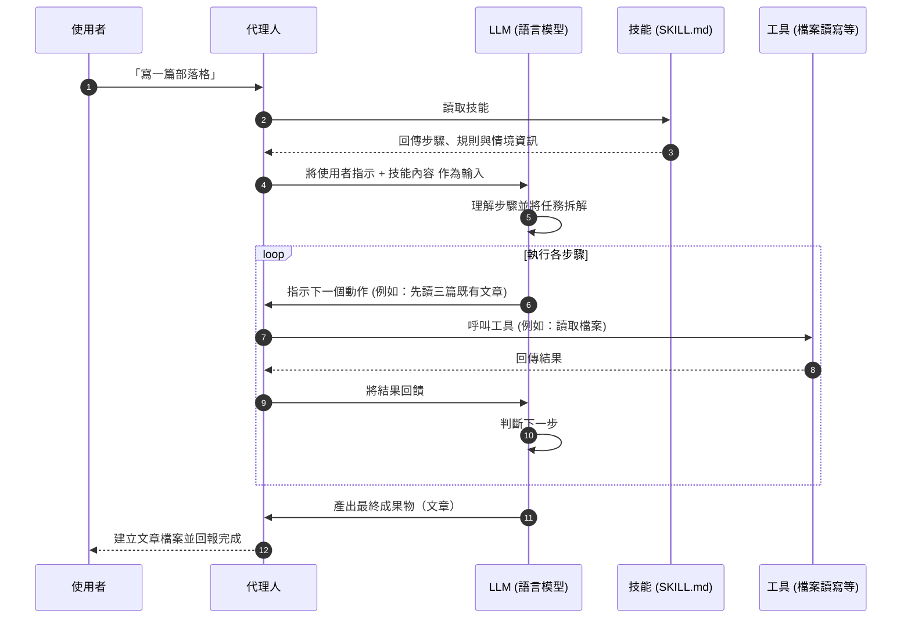

將「技能」加入 AI 代理人，就像在應用程式安裝功能擴充一樣，可以增加它能做的事情。本文解說 Agent Skills 的運作方式，以及代理人在內部如何處理任務。

{/**/}

## AI 代理人是什麼

首先作為前提，AI 代理人是指「接受指示並能自主執行任務的 AI 程式」。

與像 ChatGPT 那種「問了就回答」的 AI 不同，代理人可以做以下事情：

- 讀寫檔案
- 執行程式碼並檢查結果
- 呼叫外部 API 或工具
- 自行判斷並執行多步驟流程

## 技能是什麼

[Agent Skills](https://agentskills.io/home) 是一種「用來為代理人新增能力或專業知識的機制」。

比喻成人類的話，就像把「新的工作手冊」交給對方一樣。閱讀了手冊（技能）的代理人就能理解該任務應如何進行，並據此行動。

```
無技能: 「寫一篇部落格」→ 代理人隨便寫
有技能: 「寫一篇部落格」→ 按照手冊步驟，以一定品質寫出文章
```

技能主要以 Markdown 檔案（`SKILL.md`）描述，通常包含以下要素：

- **步驟說明**：要做哪些事、按什麼順序做
- **腳本**：想自動化的處理流程
- **範例與設定**：代理人會參考的資源

## 為什麼需要技能

AI 代理人能力很強，但**不會預先具備你專案特有的知識**。

例如：

- 「這個團隊要如何撰寫提交訊息」
- 「這個部落格的 front matter 要如何寫」
- 「部署流程要用哪個指令」

這類資訊如果不以技能方式提供，代理人無從得知。有了技能，代理人就能在知道「正確做法」的前提下執行任務。

## 代理人使用技能時的處理流程

接下來看看代理人在內部如何運作。



重點如下：

### 1. 載入技能

代理人一開始會載入技能。技能內容成為輸入給 LLM 的一部分（提示）。LLM 讀到後會理解「這個任務的正確做法」。

### 2. 任務拆解

LLM 根據收到的步驟，將任務拆成小步驟。例如「先閱讀既有文章 3 篇」「接著決定檔名」「寫 front matter」等。

### 3. 呼叫工具

在每個步驟中，視需要呼叫工具：讀檔、搜尋網路、執行程式碼等，依照技能定義的流程執行。

### 4. 結果回饋

工具執行的結果會再次傳回給 LLM。LLM 根據結果判斷「下一步要做什麼」，並持續迴圈直到任務完成。

## 技能指令

技能可以透過斜線指令（/命令名）來呼叫。

呼叫指令時，對應的 Markdown 檔內容會被展開為提示，代理人就會開始依該步驟執行。

## 技能的應用範圍

Agent Skills 的格式是 [由 Anthropic 開發並開放的](https://agentskills.io/home)，目前支援許多工具。

| 工具 | 是否支援 |
|--------|------|
| Claude Code | ✅ |
| GitHub Copilot | ✅ |
| Cursor | ✅ |
| Gemini CLI | ✅ |
| OpenAI Codex | ✅ |
| VS Code | ✅ |

同一套技能能在多個工具間重複使用，這是很大的優勢。

## 總結

- **技能**是把專業知識或操作步驟傳給代理人的機制
- 只要撰寫 Markdown 檔（`SKILL.md`）描述步驟與規則，就能建立技能
- 代理人把技能當成提示給 LLM，LLM 會解讀並按步驟執行
- 這是個開放且跨工具的標準格式，如 Claude Code、Cursor、GitHub Copilot 等均可共用

善用技能可以省去「每次都要向 AI 解釋同一件事」的麻煩，讓代理人以一致的品質完成任務。