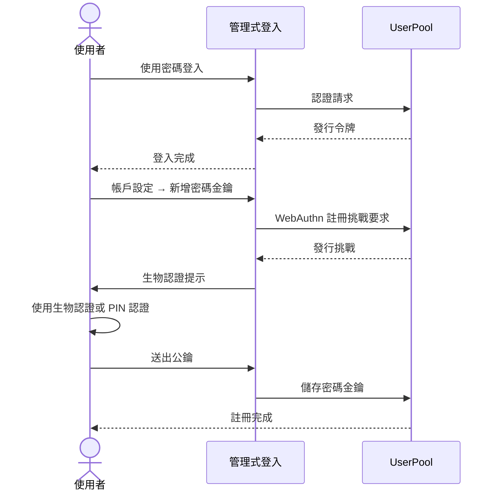
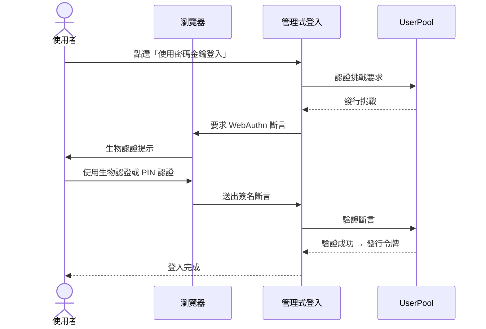

在使用 AWS SAM 建立的檔案儲存 API 的使用者認證中，我使用了 Amazon Cognito。最近我新增了透過密碼金鑰 (WebAuthn) 登入的功能，因此總結一下設定內容。

{/**/}

## 前提條件：使用密碼金鑰所需的 Cognito 設定

要在 Cognito 中使用密碼金鑰，必須具備以下所有條件。

| 要件 | 本次的架構 |
|------|-----------|
| UserPool 層級 | **ESSENTIALS** 以上 |
| 管理式登入 | **v2** (新的登入 UI) |
| 自訂網域 | `login.example.com` (用於 Relying Party ID) |

Cognito 的密碼金鑰必須從管理式登入 v2 UI 中註冊及使用。在 LITE 層級 (免費) 中無法使用 WebAuthn，因此需要 ESSENTIALS 層級。

## 認證流程

### 密碼金鑰註冊流程

第一次登入時使用密碼，然後從帳戶設定中註冊密碼金鑰。



### 密碼金鑰登入流程

註冊後，可以透過「使用密碼金鑰登入」按鈕直接認證。



## 設定內容

為了新增密碼金鑰，我在 `template.yaml` (SAM 模板) 上進行了僅 6 行的變更。

### 變更前

```yaml
UserPool:
  Type: AWS::Cognito::UserPool
  Properties:
    # ...
    Policies:
      PasswordPolicy:
        MinimumLength: 8
        # ...
    MfaConfiguration: "OFF"
```

### 變更後

```yaml
UserPool:
  Type: AWS::Cognito::UserPool
  Properties:
    # ...
    Policies:
      PasswordPolicy:
        MinimumLength: 8
        # ...
      SignInPolicy:
        AllowedFirstAuthFactors:
          - PASSWORD
          - WEB_AUTHN       # ← 新增密碼金鑰
    MfaConfiguration: "OFF"
    WebAuthnRelyingPartyID: login.example.com   # ← 指定 RP ID
    WebAuthnUserVerification: required              # ← 強制要求生物認證
```

## 各參數的意義

### `SignInPolicy.AllowedFirstAuthFactors`

初步認證步驟中可用的認證方式列表。只有 `PASSWORD` 時僅能使用密碼，若加上 `WEB_AUTHN` 則能選擇密碼金鑰。

### `WebAuthnRelyingPartyID`

WebAuthn 的 **Relying Party ID (RP ID)**。密碼金鑰將綁定到此網域生成和儲存，因此必須與 **實際提供登入頁面的網域一致**。

本次直接使用自訂網域 `login.example.com`。若使用 Cognito 的預設網域 (`xxx.auth.ap-northeast-1.amazoncognito.com`)，則需指定該網域。

### `WebAuthnUserVerification`

使用密碼金鑰時的用戶確認等級。

| 值 | 說明 |
|----|------|
| `required` | 強制要求生物認證或 PIN 等的身份確認 |
| `preferred` | 儘可能要求身份確認，但可不要求 |
| `discouraged` | 省略身份確認 (不使用生物認證等) |

為了提高安全性，選擇了 `required`。

## 管理式登入的 UI

在管理式登入 v2 的界面中，密碼金鑰設定後，登入畫面將自動新增「使用密碼金鑰登入」按鈕。第一次註冊時需先使用密碼登入，然後可在帳戶設定中新增密碼金鑰。

## 部署

```bash
sam build
sam deploy --no-confirm-changeset
```

由於 `samconfig.toml` 中已定義堆疊名稱、區域及參數，因此每次部署時不需要指定選項。

## 總結

啟用 Cognito 密碼金鑰的重點總結如下：

1. 設定為 **ESSENTIALS 層級** (LITE 不支持 WebAuthn)
2. 使用 **管理式登入 v2**
3. 指定自訂網域 (或 Cognito 預設網域) 為 RP ID
4. 在 `SignInPolicy.AllowedFirstAuthFactors` 中增加 `WEB_AUTHN`
5. 使用 `WebAuthnUserVerification: required` 強制要求生物認證

僅透過 6 行的變更，即可使用密碼金鑰登入。此時仍保留密碼，逐步向密碼金鑰過渡，這正是 Cognito 的便利之處。